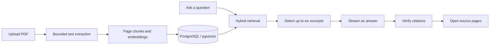

# StudyChat

**Ask questions about course PDFs. Follow each answer back to its source.**

StudyChat is a personal learning project built with React, TypeScript, FastAPI, and PostgreSQL/pgvector. It combines document retrieval, streamed answers, and quote verification so you can inspect the evidence behind a response in an embedded PDF viewer.

## What it does

- **Build a course library:** upload text-based PDFs, track processing, select sources, and delete documents.
- **Find relevant passages:** combine embedding similarity, rare-term matching, and neighboring-page context, then select up to six excerpts for an answer.
- **Stream answers:** show responses as they arrive, with cancellation and clear incomplete-response states.
- **Check citations:** validate document references, physical page numbers, and quoted text; distinguish exact and approximate matches and remove invalid citations.
- **Inspect the source:** open a citation at its PDF page and highlight the quotation when its location is unambiguous.
- **Run without an API key:** fixture mode exercises the workflow with deterministic excerpts. Live mode uses GPT-5.4 mini for generated answers.

A verified quote means the text matches a source. It does **not** prove that the answer's claim follows from that text.

## How it works



The React client handles uploads, streaming, and PDF.js viewing. FastAPI owns ingestion, retrieval, provider calls, and verification. API keys stay on the server. In live mode, OpenAI provides embeddings and answer generation; relevance selection uses the same pinned answer model.

## Run locally

**Requirements:** Python 3.12, Node.js 24, pnpm 11.19.0, and Docker with Compose. Run these commands from the repository root on macOS or Linux.

Start the database and backend:

```sh
python3.12 -m venv .venv
.venv/bin/pip install -r backend/requirements-dev.txt
docker compose up -d --wait
PYTHONPATH=backend .venv/bin/python -m studychat.db
PYTHONPATH=backend .venv/bin/uvicorn studychat.main:app --host 127.0.0.1 --port 8000
```

In a second terminal, start the frontend:

```sh
cd frontend
pnpm install --frozen-lockfile
pnpm dev
```

Open **[localhost:5173](http://localhost:5173)**. A fresh checkout defaults to fixture mode, which needs no API key and demonstrates the workflow rather than semantic question answering.

### Enable live answers

Create a local `.env` using [`.env.example`](.env.example) as a reference, then configure:

```dotenv
STUDYCHAT_PROVIDER_MODE=live
STUDYCHAT_OPENAI_API_KEY=your-api-key
STUDYCHAT_CHAT_MODEL=gpt-5.4-mini-2026-03-17
```

Restart the backend and reupload documents after switching modes: fixture and live embeddings cannot be mixed. Live uploads send extracted document text to OpenAI; questions send the question and retrieved excerpts. The UI requests consent, and API usage incurs charges. Keep `.env` out of source control.

See the [runbook](docs/RUNBOOK.md) for configuration, test commands, shutdown, and troubleshooting.

## Evaluation

The latest frozen evaluation used **20 AI-authored questions** from a cloud-computing chapter, separate from five development questions.

| Measure | Result |
| --- | ---: |
| Completed answers with citations | **20/20 · 100%** |
| Answers whose displayed pages all matched the frozen labels | **19/20 · 95%** |
| Errors or abstentions | **0** |

The earlier, separate 16-question coursework evaluation remains recorded at **13/16 passing page checks and 16/16 cited answers**. The datasets differ, so these results are not a controlled before/after comparison. Neither is an independent measure of semantic answer correctness.

The latest page-accuracy estimate has a **95% confidence interval of 76.39–99.11%**. Synthetic labels may omit valid pages; the failed check was preserved rather than relabeled after seeing the output. Quote-off, quote-on, and exact-only replay produced the same question-level counts.

Read the [evaluation report](docs/EVALUATION_RESULTS.md) for frozen configurations, failure analysis, and limitations. Public artifacts include synthetic questions, source hashes, and aggregate results. Coursework PDFs, extracted text, and raw answers remain local; generated fixtures support public testing.

## Validation and limits

**118 backend tests, 11 frontend tests, seven Chromium browser workflows, and the production build passed.** [GitHub Actions](https://github.com/alladikarthik02/StudyChat-Course-Q-A-with-Verified-Page-Citations/actions) runs the automated checks with a real PostgreSQL/pgvector service.

This is a single-user local application. It does not include public authentication, multi-user isolation, or OCR. Diagrams and scanned pages may contain information absent from extracted text. Approximate quote matching can miss meaning changes, and ambiguous matches show the page without guessing a highlight. The evaluation threshold is not validated for rejecting unanswerable questions.

## Explore the project

| Document | Contents |
| --- | --- |
| [Technical specification](docs/TECH_SPEC.md) | Architecture, data flow, contracts, and design decisions |
| [Challenges](docs/CHALLENGES.md) | Problems encountered, tradeoffs, and solutions |
| [Safety requirements](docs/SAFETY.md) | Source scoping, parsing limits, secrets, and failure handling |
| [Evaluation guide](docs/EVALUATION.md) | Datasets, calibration, replay, and reproducibility |
| [Learning goals and evidence](docs/PROJECT_EVIDENCE.md) | What the implementation and measurements establish |
| [Implementation checkpoints](docs/TASKS.md) | Completed tasks and their validation |
| [Runbook](docs/RUNBOOK.md) | Setup, checks, configuration, and troubleshooting |
