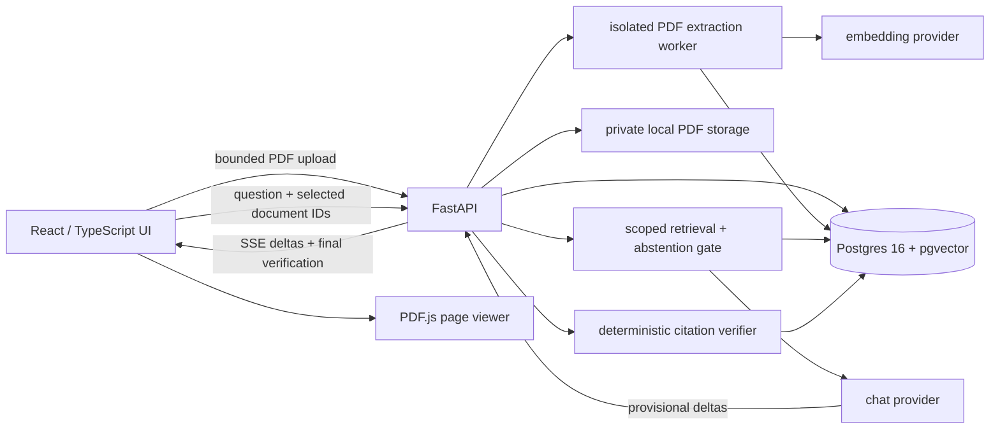

# StudyChat technical specification

Status: T0–T3 complete: architecture, foundation, ingestion, and citation verification. Retrieval/chat/UI integration remain planned. No answer-quality metrics measured yet.

## Goal and boundaries

Let a student upload course PDFs, ask a question, watch an answer stream, and open the exact PDF page for a verified quotation. Match the first resume project's functional scope: React/TypeScript, Python FastAPI, OpenAI API, PostgreSQL/pgvector, streaming, and a reproducible citation evaluation.

Initial deployment is a single-user local application bound to loopback. Public hosting and multi-user accounts are out of scope; they require authentication, per-owner access checks, and a separate deployment review. Support text PDFs first. Scans produce an explicit unsupported/no-extractable-text result; OCR is not silently simulated.

Other exclusions: custom streaming markdown package, attack classifier and red-team benchmark, shared API key gateway, autonomous tools, web search, and model training.

## Essential user functions

- Upload a PDF, see ingestion state and useful failure messages, list ready documents, and delete a document.
- Select one or more ready documents and ask a bounded-length question.
- Stream provisional answer text; show an explicit abstention when retrieval is weak.
- Convert validated citations into page chips; display invalid references as “citation removed.”
- Open the correct document at its physical PDF page and highlight a matched quotation where text mapping allows it.
- Distinguish exact-normalized matches from approximate matches. If highlighting fails, still open the verified page and show the quote.
- Cancel a request and recover gracefully from upload, provider, database, and stream errors.
- Run offline tests without an API key, then run a separately identified live evaluation.

## Architecture

FastAPI owns secrets, storage access, retrieval, citation verification, and request limits. The browser never receives the provider key. Provider calls use explicit timeouts and output limits. A provider interface supports deterministic fixtures and a live OpenAI adapter. Fixture mode is visibly labeled and cannot produce resume benchmark evidence.

Use an ingestion subprocess with memory/time limits for untrusted PDFs. The API orchestrates its lifecycle and cleans up partial work. A durable external queue is unnecessary for this local version: on startup, mark interrupted pending jobs failed and allow retry. Do not leave documents indefinitely “processing.”

## Data model

- `documents`: UUID, display filename, SHA-256, state (`pending`, `processing`, `ready`, `failed`, `deleting`), page count, embedding model/version, created time, safe error code. Original filenames are never filesystem paths.
- `pages`: document UUID, physical page number starting at 1, extracted text, normalized text, normalization version. Unique `(document_id, page)`.
- `chunks`: UUID, document UUID, page, ordinal, text, source character offsets, embedding vector. Long pages are split into bounded overlapping chunks that never cross a physical page. This avoids losing page identity while respecting embedding/context limits.
- Store title/subject metadata as a bounded page-0 chunk, labeled `metadata`. Exclude it from answer retrieval and valid page citations in project 1; retaining it does not make it trusted instructions.
- Use cascading database deletes. Store files under generated UUIDs outside frontend assets. Deletion first makes the document unavailable, removes the file, then finalizes database removal; failed cleanup is retryable and visible.

Start with exact cosine retrieval filtered by selected ready document IDs. For the small intended corpus this avoids approximate-index recall/filtering surprises. Add an index only after measuring a need. Query and document embeddings must use the same model and dimensions; refuse incompatible data rather than mixing spaces.

## Ingestion contract

Initial configurable limits: 20 MiB/file, 300 pages/file, 2 million extracted characters/document, one active ingestion, 60-second parsing deadline. These are operating defaults, not benchmark findings. Validate multipart length while reading, PDF signature, successful parser result, encryption status, and page/text limits. Reject encrypted PDFs, malformed files, empty text, and limit violations with stable error codes.

Extract per physical page with pypdf, normalize text, split long pages, embed bounded batches, and atomically publish database content as ready. Failed extraction or embedding must never yield a ready document with partial chunks. Staged files are cleaned after failure. Re-uploaded content can be deduplicated by content hash, but a failed ingestion remains retryable.

Show before live ingestion that extracted text will be sent to the configured provider. User chooses live mode knowingly; no document content is sent in fixture mode.

## API and stream contract

| Endpoint | Contract |
| --- | --- |
| `POST /documents` | Multipart PDF; return 202 with document ID and ingestion status |
| `GET /documents` | List document metadata and state |
| `GET /documents/{id}` | Poll ingestion result |
| `GET /documents/{id}/file` | Serve validated PDF from private storage; no arbitrary paths |
| `DELETE /documents/{id}` | Idempotent cleanup; unavailable to new chats immediately |
| `POST /chat` | JSON `{question, document_ids}`; streamed response |
| `GET /health` | Process health, without secrets |
| `GET /ready` | Database/schema/config readiness |

Use fetch streaming for POST requests, not browser EventSource (which does not provide this POST body). Events use SSE framing and JSON payloads: `start`, `delta`, `abstain`, `verification`, `error`, `done`. Each carries a request ID and increasing sequence. At most one terminal `done`; no deltas after a terminal outcome. Heartbeats are comments. The client decoder handles arbitrary byte boundaries, split UTF-8, multiple events per read, and incomplete/disconnected streams.

Pre-stream validation errors use normal HTTP status codes. Once streaming begins, errors use a sanitized SSE error and terminal outcome. Cancel/disconnect stops upstream work and releases concurrency slots. No automatic generation retry after visible text. A bounded provider retry before output may be configured and tested explicitly.

## Retrieval and answer lifecycle

1. Validate question length (initially 4,000 characters), selected document count (initially 10), readiness, and concurrency limits.
2. Embed question and retrieve top 6 page chunks, with stable tie-breaking and a bounded context budget. Filter by document IDs in the database query, not afterward.
3. Compare the best cosine similarity to a frozen development threshold. Below threshold or no content: emit an abstention before any answer delta. A default experimental threshold must be labeled untuned.
4. Give each retrieved document a request-local alias (D1, D2). Fence all excerpts as untrusted data, with server-controlled alias and physical page number. No tools or secrets are in the model context.
5. Require each factual claim to include `[D1 p.3 "exact quote"]`. Document identity is necessary because two PDFs can both have page 3. Single-document display may shorten this to `[p.3]` after resolution.
6. Stream text as explicitly provisional. After completion, parse citations conservatively, resolve aliases from server state, and verify against the cited page in the selected/retrieved context. Unknown aliases, metadata page 0, invalid pages, and malformed citations fail closed.
7. Send the final authoritative answer/citation representation and invalid citation reasons. Do not silently rewrite a failed citation to another page. If no citations survive, show “No verified citations” and count it as unanswered in evaluation. Do not present it as a verified answer.

The product verifies quotations, not semantic entailment or overall factual correctness. A true quotation attached to a misleading claim is still possible and must not receive an “answer verified” badge.

## Verification and highlighting

Normalize source and quote consistently: Unicode NFKC (including common ligatures), dehyphenate alphabetic line-break splits, collapse whitespace. Preserve punctuation and case initially. Retain normalized-to-source offsets for highlight mapping.

Check exact normalized substring first. For the build guide's fuzzy option, compare length-bounded candidate windows using a deterministic, documented ratio with threshold 0.90. Record algorithm/version and actual score. Approximate matches are labeled as such; they are not “verbatim.” Very short quotes need exact matching (initial rule: fewer than 20 normalized characters); cap quote length and candidate comparisons to bound work. Test one-character negations and numeric substitutions explicitly: fuzzy matching can accept meaningful changes. Report exact-only sensitivity in evaluation and do not equate fuzzy acceptance with semantic correctness.

The backend sends physical page, quote, match type, score, and source offsets. PDF.js text items may differ from pypdf extraction. The frontend builds its own text-item mapping and highlights only an unambiguous match. On ambiguity, open the page with a visible quote panel instead of drawing a false highlight. Printed page labels are supplemental; physical page index is authoritative.

## Evaluation and reproducibility

Separate a 20-question development split from 120 answerable held-out questions across approximately 30 permitted course PDFs. Gold document/page pairs must be labeled from PDFs before system output is inspected. Keep development and held-out question IDs disjoint; record corpus hashes, provenance, and duplicate/leakage checks. Human labels and classmate interviews cannot be fabricated.

`eval/cite_eval.py --quotes off|on` is the planned interface. Generate once per question and save raw output, retrieval, and parsed citations. Apply both verification modes to those same outputs for the primary paired comparison; an independent-generation experiment must be labeled separately. Neither mode can count zero-citation outputs as correct.

- Answer rate = questions with a completed answer and at least one surviving citation / all 120 answerable questions.
- Page accuracy among answered = answered questions whose every displayed citation `(document_id, physical_page)` is in the gold set / answered questions.
- Joint success = correctly cited answered questions / all 120 questions.
- Also print raw counts, abstentions, provider failures, removed citations, exact/approximate counts, and per-question outcomes. Failures stay in denominators. Use “N/A” when the answered denominator is zero.

This measures page correctness, not whether all necessary pages were cited or the answer entailed the source. Report that limitation. Add adversarial/unanswerable smoke questions separately; do not silently change the 120-question answer-rate denominator.

Freeze the development threshold before held-out scoring. Record selected model snapshot, embedding model, prompt hash, package locks, normalization version, configuration, random settings, git revision, PDF hashes, timestamps, and raw responses. Cached replay makes scoring reproducible; live model generations are not guaranteed identical. Pin the exact available model snapshot during adapter implementation after consulting current official documentation; no floating production alias as a substitute for a recorded snapshot.

Resume values (74%, 90%, 95%, 1 in 4, 8 classmates) are claims to validate, not acceptance thresholds to force. If observed evidence differs, revise the resume.

Engineering performance objectives are simultaneously >=90% verified page accuracy among answered questions and >=95% answer rate. Every task maps to these objectives in TASKS.md; RESUME_EVIDENCE.md defines the diagnostic and improvement policy. Passing functional tests does not establish these empirical results. The baseline is measured without deliberate degradation, and tuning must not consume the held-out set.

## Testing and acceptance

Unit: normalization, quote parsing, document/page resolution, exact/fuzzy boundary cases, numeric/negation limitations, threshold boundary, chunk boundaries, metric denominators, malformed SSE fragments.

Integration with real Postgres/pgvector: schema migration from empty DB, selected-document filtering, embedding dimension mismatch, atomic ingestion failure, deletion/cancellation races, cosine retrieval ordering, and cleanup after restart.

API tests with a fake provider: malformed/oversized/encrypted PDF, empty text, timeout, provider 429/5xx, disconnect, no credentials, no output before abstention, sanitized errors, and no file path traversal.

Browser tests: upload → ready → ask → provisional stream → verification → correct PDF page; invalid citations; no surviving citation; cancellation; long response scroll behavior; keyboard access; plain text/escaped model output against XSS.

Evaluation tests: hand-calculated fixtures for every metric, duplicates, missing gold pages, wrong-document same-page citations, zero answers, provider errors, paired off/on comparison, and non-finite scores.

Completion requires a fresh-checkout runbook, locked dependencies, passing offline unit/integration/browser checks, safe fixture demo, and clearly separated live evaluation status. A functioning product may precede human evidence; the resume claims remain unverified until that evidence exists.

## T3 implementation decisions

The verifier is currently an internal Python service, ready to integrate into T4 chat. It accepts server-resolved aliases and at most six retrieved ready page sources. Repository loading filters both selected document IDs and physical page pairs; metadata cannot be cited. No browser endpoint accepts arbitrary “source text” as verification evidence.

Normalization version is `nfkc-grapheme-dehyphen-ws-v2`. Offsets are Python Unicode code-point offsets into pypdf text, not PDF.js glyph indexes or JavaScript UTF-16 indexes. T5 must perform its own text-item mapping as specified above. Repeated exact matches or tied approximate locations yield no highlight offsets; the page and quote remain available.

Approximate matching uses RapidFuzz normalized indel ratio, minimum 0.90, over whitespace-token windows of quote token count ±2. It is deliberately bounded and is not exhaustive approximate substring search. A changed number or recognized English negation token is rejected. Other meaning changes remain possible and are explicitly tested. “Exact” means exact after the documented normalization, not byte-identical to the PDF.

Limits: 100,000 answer characters, 100 citations, 2,000 raw/normalized quote characters, six page sources totaling at most 2 million characters, approximate matching only on pages up to 100,000 normalized characters, and 10,000 fuzzy comparisons shared across the answer. Short quotes under 20 normalized characters require exact matching. Resource-limit errors must become a safe terminal chat outcome in T4, never a verified answer. These defaults may reduce answer rate; T6 must count and report their impact before changing them on development data.
